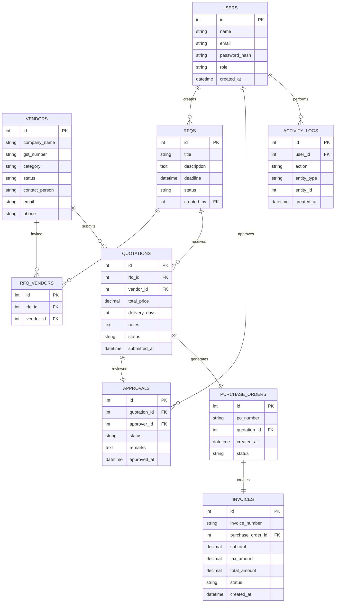
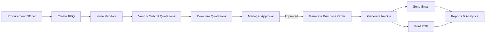

# vendor odoo hackathon

# Member 1 — Backend + Database + Business Logic

### Responsibilities

#### Authentication & Roles

* Login
* Signup
* JWT/Auth
* RBAC (Admin, Vendor, Manager, Procurement Officer)

#### Database Design

Create all entities:

```text
User
Vendor
RFQ
Quotation
Approval
PurchaseOrder
Invoice
ActivityLog
```

#### APIs

* Vendor CRUD
* RFQ CRUD
* Quotation Submission
* Approval APIs
* PO Generation
* Invoice Generation

#### Business Workflow

```text
RFQ
 ↓
Quotation
 ↓
Approval
 ↓
PO
 ↓
Invoice
```

This is the heart of the project.

#### PDF & Email

* Generate Invoice PDF
* Send invoice email

---

# Member 2 — Frontend + Dashboard + UX

### Responsibilities

#### UI Design

* Layout
* Sidebar
* Navbar
* Responsive pages

#### Screens

```text
Login
Dashboard
Vendor Management
RFQ Creation
Quotation Submission
Quotation Comparison
Approval Workflow
PO & Invoice
Reports
```

#### Dashboard

* Analytics cards
* Charts
* Statistics

#### Tables

* Search
* Filter
* Sorting
* Pagination

#### Role-based UI

Show different menus for:

* Admin
* Vendor
* Manager
* Procurement Officer

---

# Integration Points


Example:

```json
GET /api/vendors

POST /api/rfqs

POST /api/quotations

POST /api/approvals

POST /api/purchase-orders

POST /api/invoices
```

## Database Relationship Diagram




---

## Workflow Diagram (Also GitHub Compatible)





---

## Simplified Domain Model

This is the mental model judges will care about:

```text
User
 │
 ├── Creates RFQ
 │
RFQ
 │
 ├── Assigned to Vendors
 │
 └── Receives Quotations
          │
          ▼
      Quotation
          │
          ▼
      Approval
          │
          ▼
   Purchase Order
          │
          ▼
       Invoice
```

### Division

**Member 1**

* Users
* RFQs
* Quotations
* Approvals
* Database

**Member 2**

* Vendors
* Purchase Orders
* Invoices
* Dashboard
* Reports/UI

